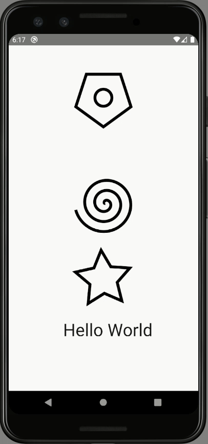

# POC: Animated API

It demonstrate how to implement basic animations using React Native [Animated API](https://reactnative.dev/docs/next/animated). There are examples of rotation, axis movement, animation-based styles, easing functions and combinations.

## How to run

| Description | Command |
| :--- | :--- |
| Install dependencies | `npm install` |
| Run tests | `npm test` |
| Start Metro | `npm start` |
| Run app | `npm run android` |

## Preview

> Disclaimer: It looks uneven on the image below, but it runs smoothly on the device.

